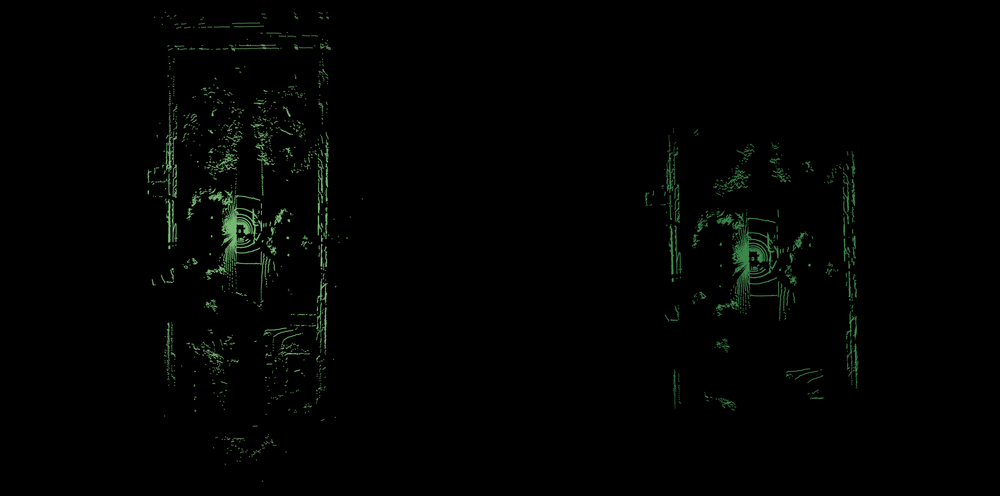
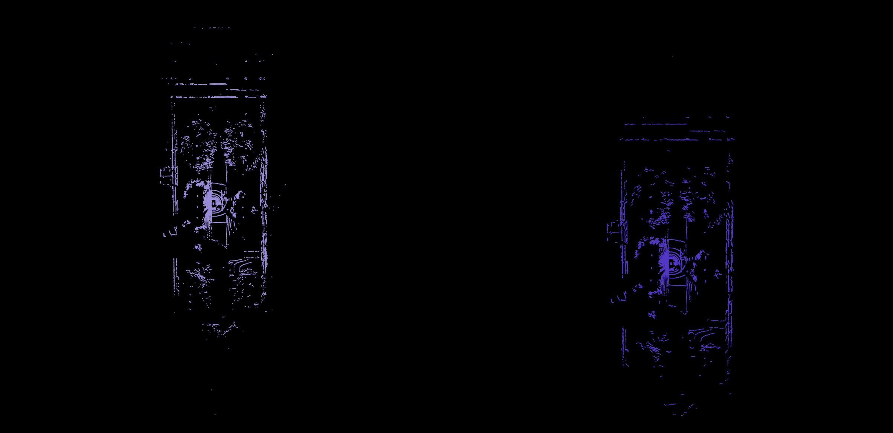
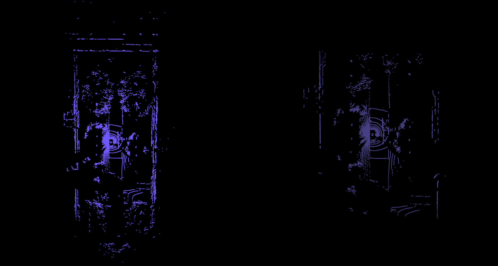
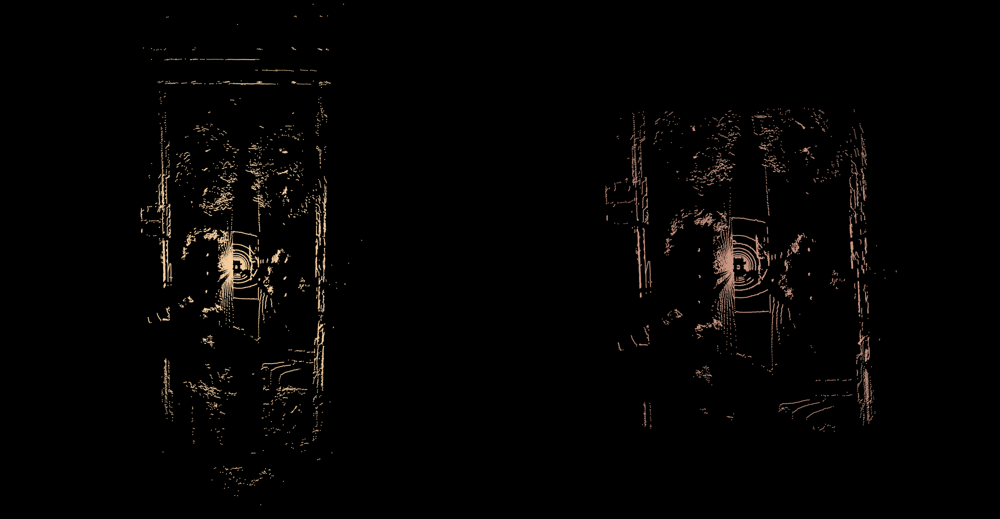

# PCL 点云滤波器 总结

## 1.统计滤波
方法：

1）遍历每个点，用KNN获取每个点的K个邻居，并计算其与邻居的距离值，保存每个点的距离均值；

2）使用每个点的距离均值计算点云的均值和标准偏差；

3）遍历每个点，若该点的距离均值大于 $\mu$ + std_mul * $\sigma$，则认为其为外点。

人为给定的阈值为邻居数量K，标准差倍数阈值std_mul

核心代码：

```bash
double sum = 0, sq_sum = 0;
for (const float &distance : distances)
{
sum += distance;
sq_sum += distance * distance;
}
double mean = sum / static_cast<double>(valid_distances);
double variance = (sq_sum - sum * sum / static_cast<double>(valid_distances)) / (static_cast<double>(valid_distances) - 1);
double stddev = sqrt (variance);
//getMeanStd (distances, mean, stddev);

double distance_threshold = mean + std_mul_ * stddev;
```

代码中对标准偏差的公式进行推导简化，推导如下：

$\sqrt{\frac{\Sigma_{i=0}^{n}(r_i - r_m)^2}{n - 1}}$

$\sqrt{\frac{r_{1}^{2} + r_{2}^{2} + \cdots + r_{n}^{2} - 2r_{1}r_{m} - 2r_{2}r_{m} - \cdots - 2r_{n}r_{m} + nr_{m}^{2}}{n - 1}}$

$\sqrt{\frac{r_{1}^{2} + r_{2}^{2} + \cdots + r_{n}^{2} - 2nr_{m}^{2} + nr_{m}^{2}}{n - 1}}$

$\sqrt{\frac{r_{1}^{2} + r_{2}^{2} + \cdots + r_{n}^{2} - nr_{m}^{2}}{n - 1}}$

$\sqrt{\frac{r_{1}^{2} + r_{2}^{2} + \cdots + r_{n}^{2} - \frac{(r_{1} + r_{2} + \cdots + r_{n})^{2}}{n}}{n - 1}}$

滤波效果：



## 2.半径滤波
方法：

遍历每个点，查询位于半径内的点数是否满足设定阈值，若不满足则为外点

人为给定的阈值为半径大小、半径内的点数阈值

核心代码：

```
int k = searcher_->radiusSearch (*it, search_radius_, nn_indices, nn_dists);
```

滤波效果：



## 3.直通滤波
方法：

在X、Y和Z三个方向上设置不同的边界阈值进行裁减

滤波效果：



## 4.条件滤波
方法：

可以根据点云的维度信息设置不同的条件，比如根据X，Y，Z设置条件，类似于直通滤波，也可以根据强度信息、RGB信息或曲率信息设置条件

滤波效果：

