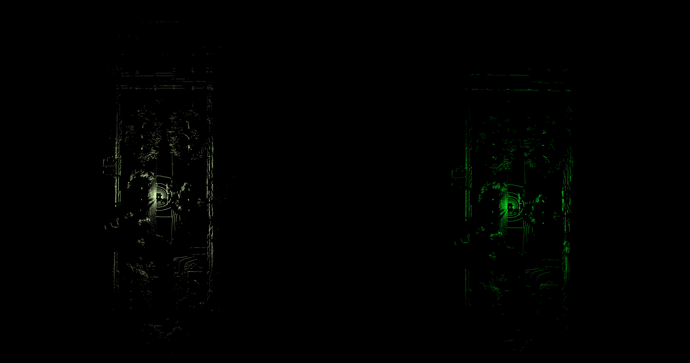
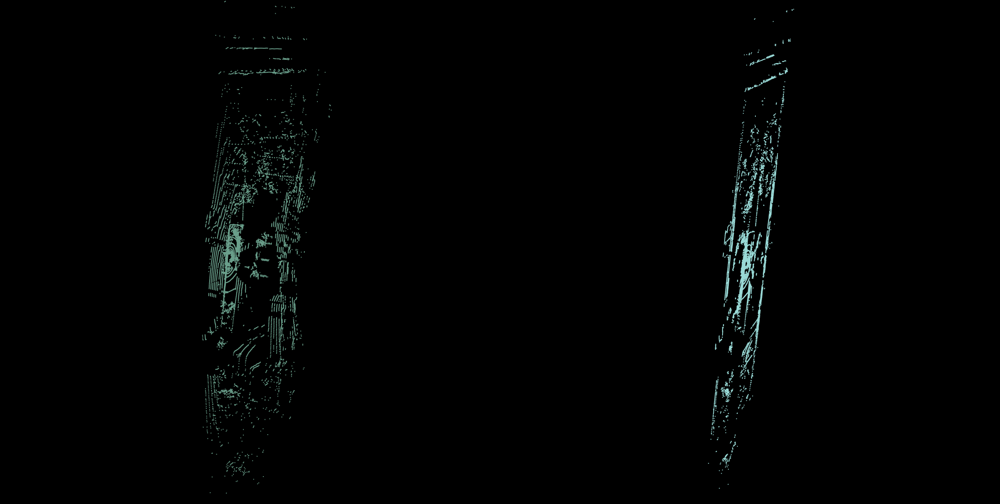
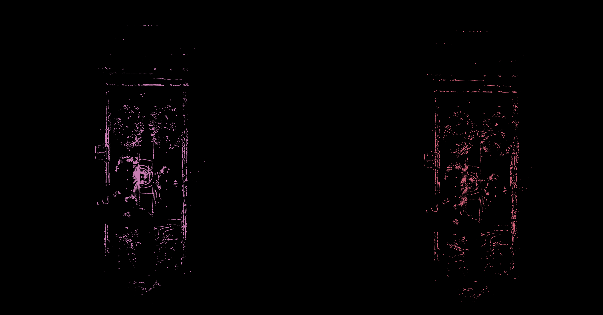

# PCL 点云滤波器 总结

## 1.统计滤波
方法：

1）遍历每个点，用KNN获取每个点的K个邻居，并计算其与邻居的距离值，保存每个点的距离均值；

2）使用每个点的距离均值计算点云的均值和标准偏差；

3）遍历每个点，若该点的距离均值大于 $\mu$ + std_mul * $\sigma$，则认为其为外点。

人为给定的阈值为邻居数量K，标准差倍数阈值std_mul

核心代码：

```
double sum = 0, sq_sum = 0;
for (const float &distance : distances)
{
sum += distance;
sq_sum += distance * distance;
}
double mean = sum / static_cast<double>(valid_distances);
double variance = (sq_sum - sum * sum / static_cast<double>(valid_distances)) / (static_cast<double>(valid_distances) - 1);
double stddev = sqrt (variance);
//getMeanStd (distances, mean, stddev);

double distance_threshold = mean + std_mul_ * stddev;
```

代码中对标准偏差的公式进行推导简化，推导如下：

$\sqrt{\frac{\Sigma_{i=0}^{n}(r_i - r_m)^2}{n - 1}}$

$\sqrt{\frac{r_{1}^{2} + r_{2}^{2} + \cdots + r_{n}^{2} - 2r_{1}r_{m} - 2r_{2}r_{m} - \cdots - 2r_{n}r_{m} + nr_{m}^{2}}{n - 1}}$

$\sqrt{\frac{r_{1}^{2} + r_{2}^{2} + \cdots + r_{n}^{2} - 2nr_{m}^{2} + nr_{m}^{2}}{n - 1}}$

$\sqrt{\frac{r_{1}^{2} + r_{2}^{2} + \cdots + r_{n}^{2} - nr_{m}^{2}}{n - 1}}$

$\sqrt{\frac{r_{1}^{2} + r_{2}^{2} + \cdots + r_{n}^{2} - \frac{(r_{1} + r_{2} + \cdots + r_{n})^{2}}{n}}{n - 1}}$

滤波效果：


## 2.半径滤波
方法：

遍历每个点，查询位于半径内的点数是否满足设定阈值，若不满足则为外点

人为给定的阈值为半径大小、半径内的点数阈值

核心代码：

```
int k = searcher_->radiusSearch (*it, search_radius_, nn_indices, nn_dists);
```

滤波效果：



## 3.直通滤波
方法：

在X、Y和Z三个方向上设置不同的边界阈值进行裁减

滤波效果：


## 4.条件滤波
方法：

可以根据点云的维度信息设置不同的条件，比如根据X，Y，Z设置条件，类似于直通滤波，也可以根据强度信息、RGB信息或曲率信息设置条件

滤波效果：


## 5.投影模型滤波
方法：

将点云投影至一个指定的模型，如平面、圆柱、球等

以平面模型为例子，设平面模型为 ax + by + cz + d = 0，平面的法向量为(a,b,c)

依次计算点云中每个点到平面的距离，如下

$d = \frac{|ax_0 + by_0 + cz_0 + d|}{\sqrt{a^2 + b^2 + c^2}}$

$x' = x + d\frac{a}{\sqrt{a^2 + b^2 + c^2}}$

$y' = y + d\frac{b}{\sqrt{a^2 + b^2 + c^2}}$

$z' = z + d\frac{c}{\sqrt{a^2 + b^2 + c^2}}$

按照上述方法即可将所有点投影至指定的平面上

核心代码：

```
void projectPoints(const std::vector<int>& indices, const Eigen::VectorXf& model_coefficients, pcl::PointCloud<pcl::PointXYZ>& output, bool compute_distance)
{
    float a = model_coefficients[0];
    float b = model_coefficients[1];
    float c = model_coefficients[2];
    float d = model_coefficients[3];
    float n_norm = sqrt(a * a + b * b + c * c);

    for (const auto& index : indices)
    {
        const pcl::PointXYZ& point = cloud->points[index];
        float t = -(a * point.x + b * point.y + c * point.z + d) / (n_norm * n_norm);

        pcl::PointXYZ projected_point;
        projected_point.x = point.x + t * a;
        projected_point.y = point.y + t * b;
        projected_point.z = point.z + t * c;

        if (compute_distance)
        {
            float distance = std::abs(t * n_norm);
        }

        output.push_back(projected_point);
    }
}
```

滤波效果：



## 6.体素滤波

方法：

1）遍历每一个点，根据设置的体素值计算每个点对应的体素坐标(i, j, k)，对体素坐标进行编码，PCL内置的编码方式如下：

$index = i*1 + j*v_x + k*v_x*v_y$, $v_x$和$v_y$表示沿着x轴和沿着y轴的体素数量

2）对第一步得到的索引编码进行排序，然后构造一个pair记录每个体素对应的点索引；

3）计算每个体素内所有点的质心，作为滤波后的点。

人为给定的阈值为体素的大小

滤波效果：

